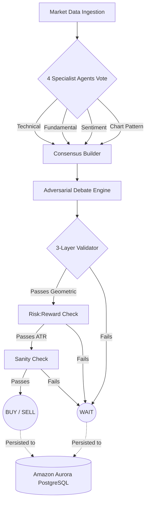

<div align="center">
  
  <h1>ArthaVest</h1>
  <p><strong>An Aurora-backed AI investment-research platform with a fully reconstructable decision ledger.</strong></p>
  <p><em>Every recommendation — from agent signal to paper-trade P&L — is fully reconstructable from Amazon Aurora PostgreSQL.</em></p>

  <p>
    
    
    
    
    
    
    
  </p>

  <p>
    <a href="#-live-demo"><strong>Live Demo</strong></a> •
    <a href="#-architecture"><strong>Architecture</strong></a> •
    <a href="#-aurora-postgresql--the-decision-ledger"><strong>Aurora Deep Dive</strong></a> •
    <a href="#-quick-start"><strong>Quick Start</strong></a> •
    <a href="#-demo-video"><strong>Demo Video</strong></a>
  </p>
</div>

---

## 📋 Table of Contents

- [The Problem](#-the-problem)
- [Our Solution](#-our-solution)
- [Architecture](#-architecture)
- [Aurora PostgreSQL — The Decision Ledger](#-aurora-postgresql--the-decision-ledger)
- [How We Used Vercel & v0](#-how-we-used-vercel--v0)
- [The AI Multi-Agent Pipeline](#-the-ai-multi-agent-pipeline)
- [App Screenshots](#-app-screenshots)
- [Tech Stack](#-tech-stack)
- [Project Structure](#-project-structure)
- [Quick Start](#-quick-start)
- [Demo Video](#-demo-video)
- [Submission Checklist](#-submission-checklist)
- [Team](#-team)
- [License](#-license)

---

## 💡 The Problem

Retail investors increasingly rely on AI-powered tools for stock analysis — but existing solutions have two dangerous flaws:

1. **No audit trail.** When an AI says "BUY," you can't trace *why* it made that call. What data did it analyze? What were the disagreements? What validation did it pass? The decision is a black box.
2. **No WAIT discipline.** Most AI agents are programmed to *always* trade — they find patterns in noise. In real-world finance, **no action is often the best action.**

Without a fully reconstructable decision history, trust is impossible — and trust is everything in finance.

---

## 🎯 Our Solution

**ArthaVest** is an AI investment-research platform where **Amazon Aurora PostgreSQL is the single source of truth** for every decision ever made.

Every recommendation flows through a multi-agent pipeline — 4 specialist agents vote, an adversarial debate engine stress-tests the consensus, a 3-layer validator gates the output — and **every step is persisted in Aurora** as a permanent, queryable audit trail.

> **The core insight:** The AI generates the *content*; **Aurora PostgreSQL is the protagonist** — the system that makes every recommendation fully reconstructable.

### What Makes ArthaVest Different

| Feature | Traditional AI Tools | ArthaVest |
|---------|---------------------|-----------|
| Decision transparency | Black-box output | Full agent-by-agent lineage stored in Aurora |
| WAIT discipline | Always recommends a trade | Firm WAIT when data is weak or contradictory |
| Audit trail | None | Every signal, debate, and validation in the DB |
| Paper trading | Manual tracking | Automatic entry/exit with P&L tracked in Aurora |
| Data architecture | Simple key-value store | 19-table normalized PostgreSQL schema |

---

## 🏗️ Architecture

```
┌─────────────┐     HTTPS      ┌──────────────────┐     REST API     ┌──────────────────────┐     SQL/SSL     ┌─────────────────────────────┐
│             │  ──────────►   │                  │  ──────────►    │                      │  ──────────►  │                             │
│   Browser   │                │   ▲ Vercel       │                 │   AWS EC2            │               │  Amazon Aurora PostgreSQL   │
│   React SPA │                │   React/Vite SPA │                 │   FastAPI Backend    │               │  Serverless v2 · us-east-1  │
│             │  ◄──────────   │   CDN + Edge     │  ◄──────────    │   Multi-Agent Engine │  ◄──────────  │  19 tables · 706+ recs      │
│             │                │                  │                 │   Python 3.12        │               │  sslmode=require            │
└─────────────┘                └──────────────────┘                 └──────────────────────┘               └─────────────────────────────┘
                                                                              │
                                                                              │  API Call
                                                                              ▼
                                                                    ┌──────────────────┐
                                                                    │  Amazon Bedrock  │
                                                                    │  Claude 3.5      │
                                                                    │  (LLM Engine)    │
                                                                    └──────────────────┘
```

**Architecture Diagram:** [architecture.svg](docs/architecture.svg)

### Data Flow

1. **User** opens the app on **Vercel** → React SPA loads from edge CDN
2. **Frontend** calls the FastAPI backend on **AWS EC2** via REST API
3. **Backend** orchestrates the multi-agent AI pipeline using **LangGraph**
4. Every agent signal, debate result, validation check, and final recommendation is **written to Amazon Aurora PostgreSQL**
5. The **Decision Audit Trail** page reconstructs the full lineage with a single Aurora JOIN query

---

## 🗄️ Aurora PostgreSQL — The Decision Ledger

> **This is the core of our submission.** Aurora PostgreSQL isn't just "where the rows live" — it's the intentional architectural choice that makes every AI decision fully auditable.

### Why Aurora PostgreSQL?

| Requirement | Why Aurora Wins |
|------------|----------------|
| **Relational integrity** | 19 tables with foreign keys, check constraints, and indexes — our data is deeply relational |
| **JSONB support** | Agent outputs, debate summaries, and full LLM responses stored as queryable JSONB |
| **Serverless v2** | Scales to zero when idle, scales up during analysis runs — cost-efficient for a research platform |
| **Production-grade** | Connection pooling, SSL/TLS enforced, auto-failover — no compromises |
| **Standard Postgres protocol** | Zero code changes from development to Aurora — same SQLAlchemy models, same queries |

### The 19-Table Normalized Schema

Our schema is designed for **full decision lineage reconstruction** — from market data ingestion to paper-trade P&L:

```
runs                     The top-level analysis run (symbol, model, timestamp)
  │
  ├── agent_logs         Individual agent signals (technical, fundamental, sentiment, chart)
  │                      ↳ signal, confidence, latency_ms, full_output (JSONB)
  │
  └── recommendations    The final AI verdict
      │                  ↳ recommendation (BUY/SELL/WAIT), confidence, narrative
      │                  ↳ debate_summary, validator_status, validator_issues
      │                  ↳ full_response (JSONB — complete LLM output)
      │
      └── paper_trades   Tracked P&L for every actionable recommendation
                         ↳ entry_price, current_price, target, stop_loss, status
```

**Additional tables:** `stocks`, `users`, `market_data`, `market_regimes`, `discovery_results`, `watchlist`, `alerts`, and more — **19 tables total** with FKs, JSONB columns, check constraints (`BUY`/`SELL`/`WAIT`/`HOLD`/`CRISIS`), and performance indexes.

### The Audit Trail Query

The "Decision Audit Trail" feature — our **intentional Aurora integration** — reconstructs a recommendation's full lineage in a single query:

```sql
SELECT r.*, run.*, al.*, pt.*
FROM recommendations r
JOIN runs run ON r.run_id = run.id
LEFT JOIN agent_logs al ON al.run_id = run.id
LEFT JOIN paper_trades pt ON pt.recommendation_id = r.id
WHERE r.id = :recommendation_id
ORDER BY al.created_at;
```

This returns the complete decision chain: which agents voted, what signals they produced, how the debate resolved, whether the validator accepted or rejected, and the resulting paper-trade P&L — **all from Aurora PostgreSQL joins.**

### Aurora Stats at a Glance

| Metric | Value |
|--------|-------|
| Total Recommendations | **706+** |
| BUY Signals | 377 |
| SELL Signals | 19 |
| WAIT Signals | 310 |
| Agent Log Records | 2,800+ |
| Tables | 19 |
| JSONB Fields | 4+ (full_response, full_output, etc.) |
| Check Constraints | 5+ (verdict types, regime types) |

---

## ▲ How We Used Vercel & v0

### Vercel Deployment

The **React + Vite + TypeScript + Tailwind** frontend is deployed to **Vercel** as a single-page application:

- **Framework:** Vite (auto-detected by Vercel)
- **Build:** `npm run build` → `dist/`
- **Routing:** SPA rewrites via `vercel.json` — all routes resolve to `index.html`
- **Environment:** `VITE_API_BASE_URL` points to the AWS-hosted FastAPI backend
- **CDN:** Static assets served from Vercel's global edge network for fast load times

```json
// vercel.json
{
  "framework": "vite",
  "buildCommand": "npm run build",
  "outputDirectory": "dist",
  "rewrites": [{ "source": "/(.*)", "destination": "/index.html" }]
}
```

### v0 Usage

We used **Vercel v0** to prototype the **Decision Audit Trail** interface — the core feature that visualizes the full Amazon Aurora PostgreSQL lineage for each AI recommendation. v0 generated the component layout (timeline, agent signal cards, paper-trade P&L card) using our existing color system (Navy `#1C2A39`, Saffron accent `#B85A10`, Tailwind), which we then wired to our FastAPI backend's `/api/audit/{id}` endpoint reading from Aurora.

**Why v0 was valuable:** The Audit Trail page is a complex, data-dense timeline view. v0 let us iterate on the layout and component structure in minutes instead of hours — focusing our development time on the backend Aurora integration instead of UI scaffolding.

---

## 🧠 The AI Multi-Agent Pipeline

ArthaVest uses a **LangGraph-orchestrated multi-agent pipeline** powered by **Amazon Bedrock (Claude 3.5 Sonnet & Haiku)**:



### The Decision Funnel

A signal only becomes a real BUY or SELL after passing strict tests:

1. **4 Specialist Agents Vote:** Technical, Fundamental, Sentiment, and Chart Pattern agents analyze real-time market data independently using Claude 3.5 Haiku for rapid processing.
2. **Adversarial Debate:** A debate engine (Claude 3.5 Sonnet) attempts to break the consensus using raw evidence. Disagreement immediately caps confidence.
3. **3-Layer Validator:** Geometric mean, Risk:Reward (ATR-based), and Sanity checks — any failure routes to WAIT.
4. **Aurora Persistence:** Every signal, debate summary, validation result, and final verdict is written to Aurora PostgreSQL — creating a permanent, queryable audit trail.

### The WAIT Discipline

Unlike most AI trading tools, ArthaVest's default posture is **WAIT**. The pipeline is designed so that:
- Weak or contradictory signals → WAIT
- Failed validation → WAIT  
- Low confidence after debate → WAIT
- **Only clear, validated, high-confidence signals pass through to BUY or SELL**

This is reflected in our Aurora data: **310 out of 706 recommendations are WAIT** — the agent exercises restraint.

---

## 📸 App Screenshots

### 📊 Dashboard
Live market indices, news feed, and portfolio overview.

### 🔍 Stock Discovery
Multi-factor screening for investment opportunities across Indian markets.

### 📜 Recommendation History
Full ledger of every AI recommendation with filter and search — every row is an Aurora query.

### 🔎 Decision Audit Trail *(New — built for this hackathon)*
The crown jewel: a timeline view reconstructing the complete decision lineage from Aurora PostgreSQL:
- **Run** → **Agent Signals** (name, signal, confidence, latency) → **Debate** → **Validator** → **Paper Trade P&L**
- Labeled: *"Reconstructed from Amazon Aurora PostgreSQL"*

---

## 🛠️ Tech Stack

| Layer | Technology | Purpose |
|-------|-----------|---------|
| **Database** | Amazon Aurora PostgreSQL Serverless v2 | 19-table decision ledger with JSONB, FKs, check constraints |
| **Frontend Hosting** | Vercel | Global CDN, edge delivery, SPA routing |
| **Frontend Framework** | React 19 + Vite + TypeScript + Tailwind CSS | Fast, type-safe UI with responsive design |
| **UI Prototyping** | Vercel v0 | Rapid component scaffolding for Audit Trail page |
| **Backend** | FastAPI (Python 3.12) on AWS EC2 | REST API, agent orchestration, Aurora connectivity |
| **ORM** | SQLAlchemy 2.0 + psycopg2 | Type-safe database access with connection pooling |
| **LLM** | Amazon Bedrock (Claude 3.5 Sonnet & Haiku) | Multi-agent reasoning and rapid data processing |
| **Agent Orchestration** | LangGraph (StateGraph DAG) | Deterministic agent pipeline with conditional routing |
| **Data Sources** | yfinance, TradingView Screener, RSS feeds | Real-time market data, screening, and news |
| **Containerization** | Docker (multi-stage build) | Reproducible deployments |

---

## 📁 Project Structure

```
vercel_aws_hack_arthvest/
│
├── frontend/                          # Frontend application
│   ├── src/
│   │   ├── pages/
│   │   │   ├── Dashboard.tsx       # Market overview + live indices
│   │   │   ├── Discovery.tsx       # Stock discovery scanner
│   │   │   ├── History.tsx         # Recommendation history ledger
│   │   │   ├── AuditTrail.tsx      # ★ Decision Audit Trail (Aurora showcase)
│   │   │   ├── Analyse.tsx         # Deep analysis view
│   │   │   └── Login.tsx           # Authentication
│   │   ├── components/             # Shared UI components
│   │   ├── services/               # API client layer
│   │   ├── context/                # Auth & app state
│   │   └── types/                  # TypeScript interfaces
│   ├── vercel.json                 # Vercel deployment config
│   ├── tailwind.config.js          # Design system tokens
│   └── package.json
│
├── backend/                           # Backend application
│   ├── app/
│   │   ├── main.py             # FastAPI app + all routes
│   │   ├── agents/             # AI specialist agents (Technical, Fundamental, Sentiment, Chart)
│   │   ├── core/               # Config, DB engine, observability
│   │   ├── db/                 # SQLAlchemy models (19 tables)
│   │   ├── services/           # Analysis dispatcher, market data, news
│   │   ├── schemas/            # Pydantic request/response models
│   │   └── api/                # Route modules
│   ├── requirements.txt        # Python dependencies
│   ├── Dockerfile              # Multi-stage Docker build
│   └── .env.example            # Environment variable template
│
└── README.md                          # ← You are here
```

---

## 🚀 Quick Start

### Prerequisites

- **Python 3.11+** (backend)
- **Node.js 18+** (frontend)
- **Amazon Aurora PostgreSQL** cluster (or any PostgreSQL instance for local dev)
- **Amazon Bedrock API configuration** (or AWS IAM Access Credentials)

### 1. Backend Setup

```bash
cd backend

# Create and activate virtual environment
python -m venv venv
# Windows
.\venv\Scripts\Activate.ps1
# macOS/Linux
source venv/bin/activate

# Install dependencies
pip install --upgrade pip
pip install -r requirements.txt

# Configure environment
cp .env.example .env
# Edit .env with your values:
#   DATABASE_URL=postgresql://<user>:<pass>@<aurora-cluster>:5432/arthavest?sslmode=require
#   AWS_ACCESS_KEY_ID=<your_aws_access_key>
#   AWS_SECRET_ACCESS_KEY=<your_aws_secret_key>
#   AWS_REGION=us-east-1

# Run the server
uvicorn app.main:app --reload --port 8000
```

The API will be live at `http://localhost:8000` with Swagger docs at `http://localhost:8000/docs`.

### 2. Frontend Setup

```bash
cd frontend

# Install dependencies
npm install

# Configure environment
cp .env.example .env
# Edit .env:
#   VITE_API_BASE_URL=http://localhost:8000

# Start development server
npm run dev
```

The app will be live at `http://localhost:5173`.

### 3. Docker (Backend)

```bash
cd backend

docker build -t arthavest-backend .
docker run -p 8000:10000 --env-file .env arthavest-backend
```

---

## 🏆 Hackathon Track

**H0: Hack the Zero Stack** — Vercel v0 + AWS Databases

- **Track:** Track 2 — B2B / Fintech
- **AWS Database:** Amazon Aurora PostgreSQL Serverless v2
- **Frontend Platform:** Vercel (React/Vite SPA)
- **UI Prototyping:** Vercel v0

---

## 👤 Team

**Rushil Mehta** — Full-stack developer & AI engineer

- Built the multi-agent pipeline, Aurora data architecture, and Vercel deployment
- Solo submission

---

## 📜 License

MIT License. See [LICENSE](backend/LICENSE) for details.

---

<div align="center">
  <br />
  <p><strong>ArthaVest</strong> — Every AI decision, fully reconstructable from Amazon Aurora PostgreSQL.</p>
  <p>
    
    
    
  </p>
</div>
